# eragent 架构设计

> 本文档由 arch-diagram skill 自动生成，与 `docs/architecture/*.dot` 架构图配套。
> 最近刷新时间：2026-05-03

## 目录

1. [系统总览](#1-系统总览)
2. [异步分析路径](#2-异步分析路径)
3. [意图识别与路由执行](#3-意图识别与路由执行)
4. [Memory 子系统](#4-memory-子系统)
5. [查询工具与本体推理](#5-查询工具与本体推理)
6. [Graphiti ETL Pipeline](#6-graphiti-etl-pipeline)
7. [多数据源切换](#7-多数据源切换)
8. [数据模型关系](#8-数据模型关系)

---

## 1. 系统总览

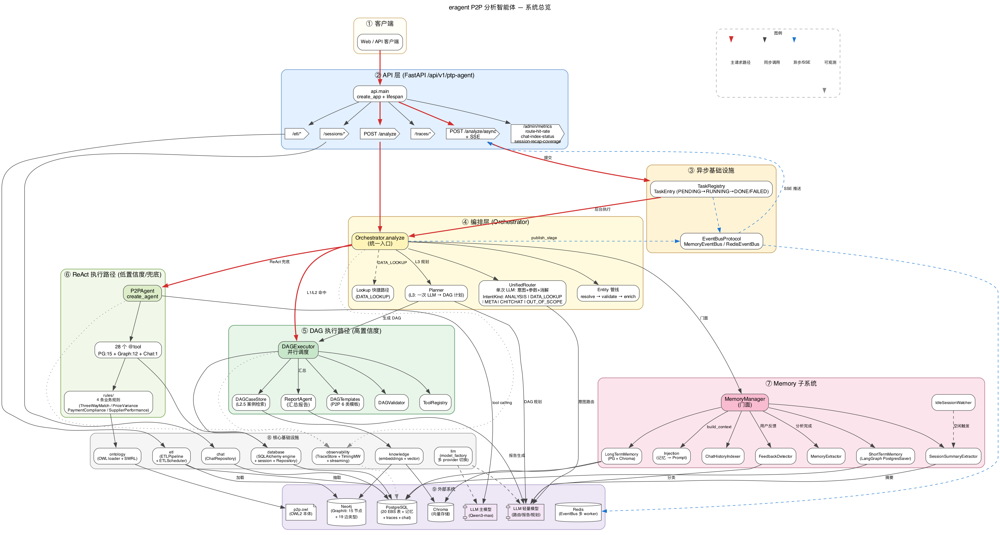

### 概述

eragent 是基于 LangChain + OWL 本体论的 ERP 采购分析智能体，采用分层架构：客户端 → API → 异步基础设施 → 编排层 → 执行层（DAG / ReAct 双路径）→ Memory → 核心基础设施 → 外部系统。系统通过 UnifiedRouter 单次 LLM 调用完成意图分类与参数提取，按置信度选择 DAG 并行执行或 ReAct 自主推理。

### 核心组件

- **API 层**：FastAPI，6 个路由模块（analyze / analyze_async / sessions / traces / etl / admin_metrics）
- **异步基础设施**：TaskRegistry（任务状态机）+ EventBusProtocol（MemoryEventBus / RedisEventBus）
- **编排层**：Orchestrator（统一入口）、UnifiedRouter（意图路由）、Planner（L3 DAG 规划）、Entity 管线、Lookup 快捷路径
- **DAG 执行**：DAGExecutor 并行调度 + DAGTemplates（6 类模板）+ DAGCaseStore（L2.5 案例检索）+ ReportAgent 汇总
- **ReAct 执行**：P2PAgent + 28 个 @tool（PG:15 + Graph:12 + Chat:1）+ 4 条业务规则
- **Memory**：MemoryManager 门面 + 9 个子组件（长/短期记忆、提取、反馈、注入、recap、索引、空闲监听）
- **核心基础设施**：database / observability / knowledge / ontology / chat / llm / etl
- **外部系统**：PostgreSQL、Neo4j、Chroma、LLM（双模型：主+轻量）、Redis

### 数据流

1. 客户端发起 `POST /analyze` 或 `POST /analyze/async`
2. API 层接收请求，同步直接调用 Orchestrator，异步提交到 TaskRegistry 后台执行
3. Orchestrator 调用 UnifiedRouter 进行意图分类（ANALYSIS / DATA_LOOKUP / META / CHITCHAT / OUT_OF_SCOPE）
4. ANALYSIS 意图：按 L1→L2→L3 逐级匹配 DAG 模板，命中则 DAGExecutor 并行执行，未命中则 Planner 生成计划或降级到 ReAct
5. DAG/ReAct 执行完毕后，ReportAgent 汇总结果，Memory 异步提取并存储记忆
6. 结果返回客户端（同步直接返回，异步通过 SSE 推送）

### 关键设计决策

- **双执行路径**：高置信度走 DAG 并行（快速、可控），低置信度走 ReAct 自主推理（灵活、兜底）
- **单次路由 LLM**：UnifiedRouter 一次调用完成意图+参数+消解，替代历史多级串行路由
- **双模型架构**：主模型（Qwen3-max）用于 tool-calling，轻量模型用于路由/报告/规划，平衡成本与质量

---

## 2. 异步分析路径

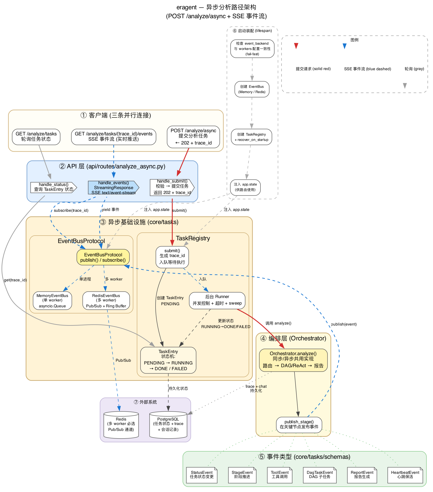

### 概述

异步分析通过 `POST /analyze/async` 提交任务，客户端通过 SSE 实时接收执行进度事件，或轮询任务状态。支持单进程（MemoryEventBus）和多 worker（RedisEventBus）两种部署模式。

### 核心组件

- **analyze_async 路由**：接收请求，创建 TaskEntry，返回 202 + trace_id
- **TaskRegistry**：管理任务生命周期（PENDING → RUNNING → DONE/FAILED），后台 runner 执行分析
- **EventBusProtocol**：事件总线抽象
  - `MemoryEventBus`：asyncio.Queue，单 worker
  - `RedisEventBus`：Redis Pub/Sub + 环形缓冲，多 worker
- **事件类型**：StatusEvent / StageEvent / ToolEvent / DagTaskEvent / ReportEvent / HeartbeatEvent
- **Lifespan 装配**：启动时创建 EventBus + TaskRegistry，注入 app.state

### 数据流

1. 客户端 POST 提交 → API 创建 TaskEntry → 返回 202 + trace_id
2. TaskRegistry 后台 runner 拉取任务 → 调用 Orchestrator.analyze
3. Orchestrator 执行过程中调用 `publish_stage()` 发布事件到 EventBus
4. 客户端 GET SSE 端点 → EventBus 推送实时事件流
5. 任务完成 → TaskEntry 状态更新为 DONE → 客户端可轮询最终结果

### 关键设计决策

- **EventBus 双后端**：开发环境用 Memory（零依赖），生产多 worker 用 Redis（Pub/Sub 广播）
- **多 worker fail-fast**：Memory 后端在检测到多 worker 时主动报错，避免事件丢失
- **心跳机制**：HeartbeatEvent 保持 SSE 连接活跃，防止代理/网关超时断开

---

## 3. 意图识别与路由执行

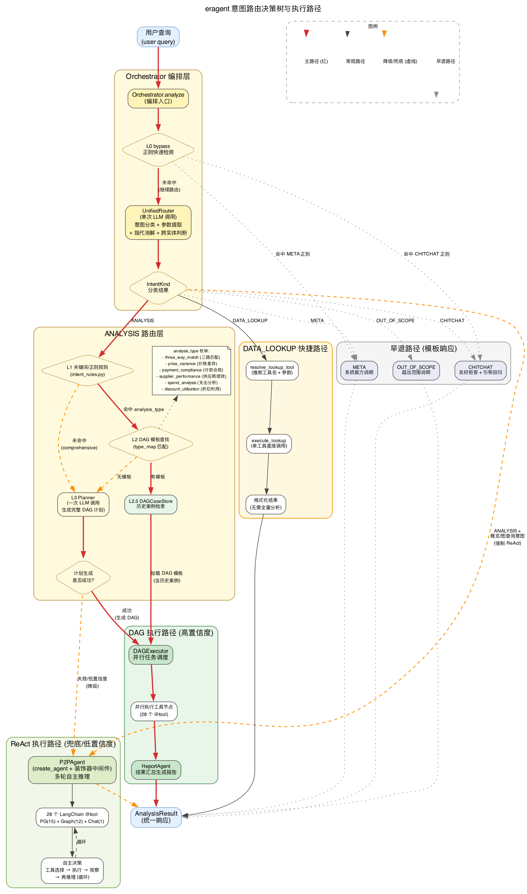

### 概述

路由系统将用户查询分类为 5 种意图（ANALYSIS / DATA_LOOKUP / META / CHITCHAT / OUT_OF_SCOPE），并为 ANALYSIS 意图按 L0→L1→L2→L2.5→L3 逐级匹配执行路径。设计原则是"尽量回复"——意图模糊时归入 ANALYSIS/comprehensive 而非拒答。

### 核心组件

- **L0 bypass**：正则快速检测 META/CHITCHAT，零 LLM 成本早退
- **UnifiedRouter**：单次 LLM 调用，输出 IntentKind + analysis_type + 参数 + 实体消解
- **L1 关键词规则**：`modules/p2p/intent_rules.py` 定义的正则/关键词匹配
- **L2 模板查找**：按 analysis_type 从 P2P DAG 模板中加载（6 类：three_way_match / price_variance / payment_compliance / supplier_performance / spend_analysis / discount_utilization）
- **L2.5 案例检索**：DAGCaseStore 从历史成功 DAG 中检索相似案例
- **L3 Planner**：一次 LLM 调用生成完整 DAG 任务计划
- **ReAct 兜底**：规划失败或置信度不足时，降级到 P2PAgent 自主推理
- **Lookup 快捷路径**：DATA_LOOKUP 直接调用单工具返回结果，跳过完整分析流程

### 数据流

1. 用户查询 → L0 正则检测（META/CHITCHAT → 模板响应，早退）
2. 非早退 → UnifiedRouter 单次 LLM → IntentKind + 参数
3. ANALYSIS → L1 关键词命中 → L2 模板加载 → DAGExecutor 并行执行
4. L2 未命中 → L2.5 案例检索 → 命中则复用历史 DAG
5. L2.5 未命中 → L3 Planner 生成 DAG → DAGExecutor 执行
6. Planner 失败 → ReAct 兜底（P2PAgent 自主 tool-calling）
7. DATA_LOOKUP → resolve_lookup_tool → execute_lookup → 格式化返回
8. META/CHITCHAT/OUT_OF_SCOPE → 模板响应直接返回

### 关键设计决策

- **单次 LLM 路由**：替代历史三级串行（L1 关键词 → L2 向量 → L3 LLM），减少延迟和 token 消耗
- **逐级降级**：L1→L2→L2.5→L3→ReAct，每级失败自动降级，保证总有执行路径
- **"尽量回复"原则**：意图模糊时不前置拦截，归入 ANALYSIS/comprehensive 走全分析流程

---

## 4. Memory 子系统

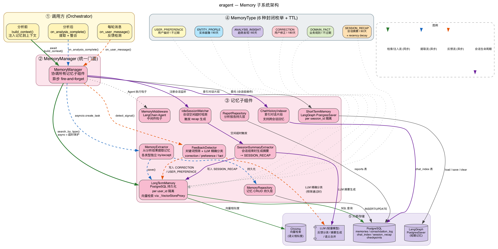

### 概述

记忆体系支持长程对话连贯性——跨会话记住用户偏好、业务实体画像、分析洞察和用户纠正。采用 MemoryManager 门面模式协调 9 个子组件，覆盖记忆的检索注入、提取整合、反馈检测和会话生命周期管理。

### 核心组件

- **MemoryManager**（门面）：对外暴露 `build_context` / `on_analysis_complete` / `on_user_message` 三个调用时机
- **LongTermMemory**：PostgreSQL 存储 + Chroma 向量检索，按 `user_id` 隔离
- **ShortTermMemory**：LangGraph PostgresSaver checkpointer，按 `session_id` 隔离
- **MemoryExtractor**：从分析结果中提取记忆条目
- **FeedbackDetector**：识别用户对分析结果的修正/确认
- **SessionSummaryExtractor**：会话结束时生成话题摘要（SESSION_RECAP）
- **ChatHistoryIndexer**：索引聊天片段，支持跨会话关键词检索
- **IdleSessionWatcher**：检测会话空闲超时，触发 recap 生成
- **Injection**：按优先级排序注入记忆到 Prompt（recency decay 权重）
- **MemoryType 枚举**（6 种，各有独立 TTL）：
  - `USER_PREFERENCE`：用户偏好，不过期
  - `ENTITY_PROFILE`：实体画像，90 天
  - `ANALYSIS_INSIGHT`：分析洞察，60 天
  - `CORRECTION`：用户纠正，180 天
  - `DOMAIN_FACT`：业务事实，不过期
  - `SESSION_RECAP`：会话摘要，90 天 + 时间衰减

### 数据流

1. **分析前（同步）**：Orchestrator 调用 `build_context` → LongTermMemory 向量检索 → Injection 按 recency 排序 → 注入 Prompt
2. **分析后（异步）**：`on_analysis_complete` → MemoryExtractor 提取 → LongTermMemory 存储
3. **用户反馈（异步）**：`on_user_message` → FeedbackDetector 分类 → 存储 CORRECTION 类型记忆
4. **会话生命周期**：IdleSessionWatcher 检测空闲 → SessionSummaryExtractor 生成 recap → 存储 SESSION_RECAP

### 关键设计决策

- **类型即契约**：6 种 MemoryType 各有独立的写入来源、TTL、检索策略，不是自由标签
- **recency decay**：记忆注入按时间衰减加权，近期记忆优先，避免过时信息干扰
- **长短分离**：短期记忆（checkpointer）负责单会话上下文，长期记忆负责跨会话知识积累

---

## 5. 查询工具与本体推理

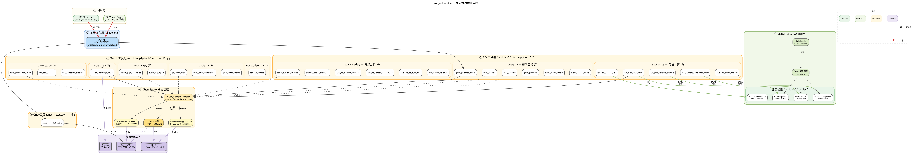

### 概述

工具集是 Agent 与 ERP 数据交互的唯一通道，共 28 个 LangChain @tool 函数，按 PG（关系查询）/ Graph（图查询）/ Chat（历史检索）三组分包。通过 `_inject.py` 统一注入 Repository + GraphitiClient + QueryBackend 依赖，支持 PG/图双后端透明切换。

### 核心组件

- **PG 工具组**（15 个，`modules/p2p/tools/pg/`）：
  - `query.py`（6 个）：query_purchase_orders / query_receipts / query_invoices / query_payments / query_vendor_master / query_supplier_profile
  - `analysis.py`（5 个）：run_three_way_match / run_price_variance_analysis / run_payment_compliance_check / calculate_supplier_kpis / calculate_spend_analysis
  - `advanced.py`（6 个）：detect_duplicate_invoices / analyze_receipt_anomalies / analyze_discount_utilization / analyze_vendor_concentration / calculate_po_cycle_time / find_contract_coverage
- **Graph 工具组**（12 个，`modules/p2p/tools/graph/`）：
  - `search.py`：search_knowledge_graph
  - `entity.py`：get_entity_detail / query_entity_relationships / query_entity_timeline
  - `traversal.py`：trace_procurement_chain / find_path_between / find_competing_suppliers
  - `anomaly.py`：detect_graph_anomalies / query_risk_impact
  - `comparison.py`：compare_entities
- **Chat 工具**（1 个）：search_my_chat_history
- **QueryBackend Protocol**（`core/etl/query_backend.py`）：
  - `PostgreSQLBackend`：直接 SQL 查询
  - `Neo4jStructuredBackend`：Cypher 查询
  - Hybrid 模式：图优先，SQL 降级
- **本体推理**：OWL2 本体（`p2p.owl`）+ SWRL 规则
- **业务规则**（4 个）：ThreeWayMatchChecker / PriceVarianceAnalyzer / PaymentComplianceChecker / SupplierPerformanceEvaluator

### 数据流

1. DAGExecutor / P2PAgent 调用 @tool 函数
2. `_inject.py` 注入 Repository + GraphitiClient + QueryBackend
3. 工具根据 QueryBackend 配置选择查询路径（PG / Neo4j / Hybrid）
4. PG 工具 → Repository → PostgreSQL（20 张 EBS 镜像表）
5. Graph 工具 → GraphitiClient → Neo4j（15 节点 + 19 边类型）
6. 业务规则引用 OWL 本体中的 SWRL 规则进行合规判定
7. `_output.py` 格式化工具返回结果

### 关键设计决策

- **双后端透明切换**：工具代码不感知后端，由 QueryBackend Protocol 屏蔽差异
- **Hybrid 过渡模式**：图优先 SQL 降级，在 Neo4j 数据完善前保证查询可用性
- **工具注入精准**：只注入当前配置下可用的工具，不注入返回空结果的占位工具

---

## 6. Graphiti ETL Pipeline

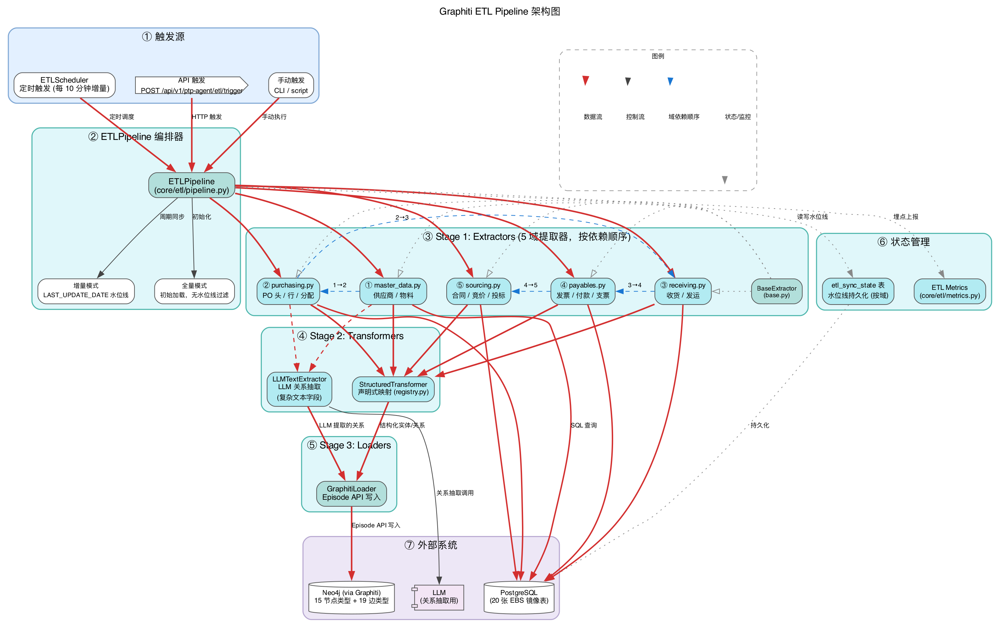

### 概述

ETL Pipeline 将 PostgreSQL 中的 EBS 镜像数据同步到 Graphiti/Neo4j 时序知识图谱。支持全量初始化和增量同步（每 10 分钟），按 5 个业务域的依赖顺序执行三阶段流水线（Extract → Transform → Load）。

### 核心组件

- **ETLScheduler**（`core/etl/scheduler.py`）：定时调度，每 10 分钟触发增量同步
- **ETLPipeline**（`core/etl/pipeline.py`）：编排入口，判定全量/增量模式
- **Extractors**（5 域，按依赖序）：
  1. `master_data.py`：供应商、物料主数据
  2. `purchasing.py`：PO 头/行/分配
  3. `receiving.py`：收货事务/发运
  4. `payables.py`：发票/付款/支票
  5. `sourcing.py`：合同/竞标/寻源
- **Transformers**：
  - `StructuredTransformer`：声明式映射（registry.py 定义 20 表 → 15 节点 + 19 边）
  - `LLMTextExtractor`：LLM 辅助抽取复杂文本字段中的关系
- **GraphitiLoader**（`core/etl/loaders/graphiti_loader.py`）：通过 Graphiti Episode API 写入 Neo4j
- **State**（`core/etl/state.py`）：`etl_sync_state` 表持久化各域水位线（LAST_UPDATE_DATE）
- **Metrics**（`core/etl/metrics.py`）：ETL 执行指标采集

### 数据流

1. 触发（调度器 / API / 手动）→ ETLPipeline 启动
2. Pipeline 读取水位线 → 判定全量 or 增量
3. 按域依赖序执行：master_data(1) → purchasing(2) → receiving(3) → payables(4) → sourcing(5)
4. 每域：Extractor 从 PG 抽取 → StructuredTransformer 映射为节点/边 → LLMTextExtractor 补充关系
5. GraphitiLoader 通过 Episode API 批量写入 Neo4j
6. 更新水位线到 etl_sync_state

### 关键设计决策

- **域依赖顺序**：主数据必须先于引用它的交易数据，保证图中引用完整性
- **声明式映射**：registry.py 集中管理 table→node/edge 映射，新增表只需加配置
- **水位线增量**：基于 LAST_UPDATE_DATE 过滤，避免全量扫描，10 分钟级别近实时

---

## 7. 多数据源切换

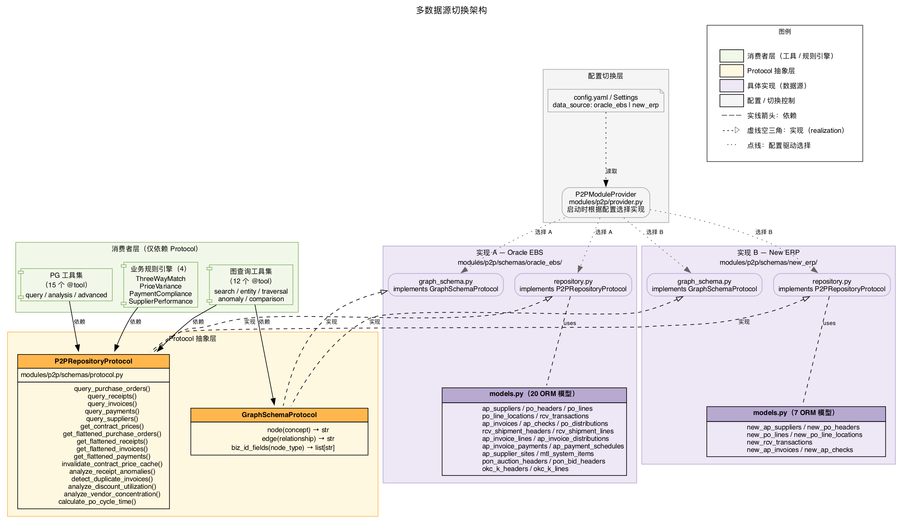

### 概述

通过 `P2PRepositoryProtocol` 抽象实现多 ERP 数据源透明切换。工具和规则只依赖 Protocol 接口，具体实现（Oracle EBS / 新 ERP）在启动时由 P2PModuleProvider 根据配置注入。新增数据源只需实现 Protocol + 注册即可，无需修改上层代码。

### 核心组件

- **P2PRepositoryProtocol**（`modules/p2p/schemas/protocol.py`）：16 个方法签名
  - 查询类：query_purchase_orders / query_receipts / query_invoices / query_payments / query_suppliers
  - 扁平化：get_flattened_purchase_orders / get_flattened_receipts / get_flattened_invoices / get_flattened_payments
  - 分析类：analyze_receipt_anomalies / detect_duplicate_invoices / analyze_discount_utilization / analyze_vendor_concentration / calculate_po_cycle_time
  - 辅助：get_contract_prices / invalidate_contract_price_cache
- **GraphSchemaProtocol**：3 个方法（node / edge / biz_id_fields），定义图节点/边命名映射
- **Oracle EBS 实现**（`modules/p2p/schemas/oracle_ebs/`）：
  - `models.py`：20 个 ORM 模型
  - `repository.py`：实现 P2PRepositoryProtocol
  - `graph_schema.py`：实现 GraphSchemaProtocol
- **新 ERP 实现**（`modules/p2p/schemas/new_erp/`）：
  - `models.py`：7 个 ORM 模型（精简字段集）
  - `repository.py`：实现 P2PRepositoryProtocol
  - `graph_schema.py`：实现 GraphSchemaProtocol
- **P2PModuleProvider**（`modules/p2p/provider.py`）：启动时按配置选择实现并注入

### 数据流

1. 启动时：P2PModuleProvider 读取配置 → 实例化对应 Repository + GraphSchema
2. 工具注入时：`_inject.py` 获取 Provider 中的 Repository 实例
3. 运行时：工具调用 Protocol 方法 → 路由到具体实现 → 查询对应数据表

### 关键设计决策

- **Protocol 解耦**：消费方（工具/规则）零感知具体数据源，新增数据源不触发上游改动
- **字段集精简**：新 ERP 只实现必要字段（7 表 vs Oracle 的 20 表），降低接入成本
- **配置驱动切换**：运行时通过 config.yaml 选择数据源，无需重新部署代码

---

## 8. 数据模型关系

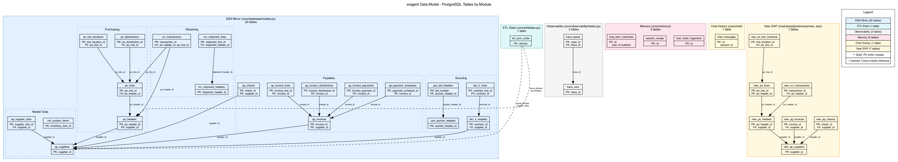

### 概述

系统共 34 张 PostgreSQL 表，分属 6 个模块。EBS 镜像表按 5 个业务域组织（主数据/采购/收货/应付/寻源），通过外键建立完整的采购链路关联。各基础设施模块（ETL/Observability/Memory/Chat）独立管理自己的表。

### 核心组件

- **EBS 镜像表**（20 张，`core/database/models.py`）：
  - 主数据域：ap_suppliers / ap_supplier_sites / mtl_system_items
  - 采购域：po_headers / po_lines / po_line_locations / po_distributions
  - 收货域：rcv_shipment_headers / rcv_shipment_lines / rcv_transactions
  - 应付域：ap_invoices / ap_invoice_lines / ap_invoice_distributions / ap_invoice_payments / ap_payment_schedules / ap_checks
  - 寻源域：pon_auction_headers / pon_bid_headers / okc_k_headers / okc_k_lines
- **ETL 状态表**（1 张，`core/etl/tables.py`）：etl_sync_state
- **可观测性表**（2 张，`core/observability/tables.py`）：trace_runs / trace_spans
- **Memory 表**（由 Alembic 管理）：long_term_memories / session_recaps / chat_index_fragments
- **Chat 表**（`core/chat/`）：chat_messages
- **新 ERP 表**（7 张，`modules/p2p/schemas/new_erp/models.py`）：new_ap_suppliers / new_po_headers / new_po_lines / new_po_line_locations / new_rcv_transactions / new_ap_invoices / new_ap_checks

### 数据流

- **采购链路**：ap_suppliers → po_headers → po_lines → po_line_locations → rcv_transactions → ap_invoices → ap_checks
- **读写分离**：EBS 镜像表由 init_data 写入 + ETL 读取；工具层只读
- **跨模块引用**：trace_spans → trace_runs（FK），ETL 按域读取 EBS 表

### 关键设计决策

- **统一 Base**：所有表共用 SQLAlchemy declarative Base，共享 engine/session
- **Alembic 管理**：15 个迁移版本（0001→0015），禁止依赖 create_all 兜底
- **域分组**：EBS 表按 P2P 业务域分组，与 ETL extractor 域一一对应

---

## 9. 核心方法时序图

以下 5 张 Mermaid 时序图展示核心链路的运行时交互序列，与前 8 张结构图互补——结构图回答"由什么组成"，时序图回答"消息怎么流转"。

### 9.1 Orchestrator.analyze() 全链路

```mermaid
文件: sequence/seq_analyze.mmd
```

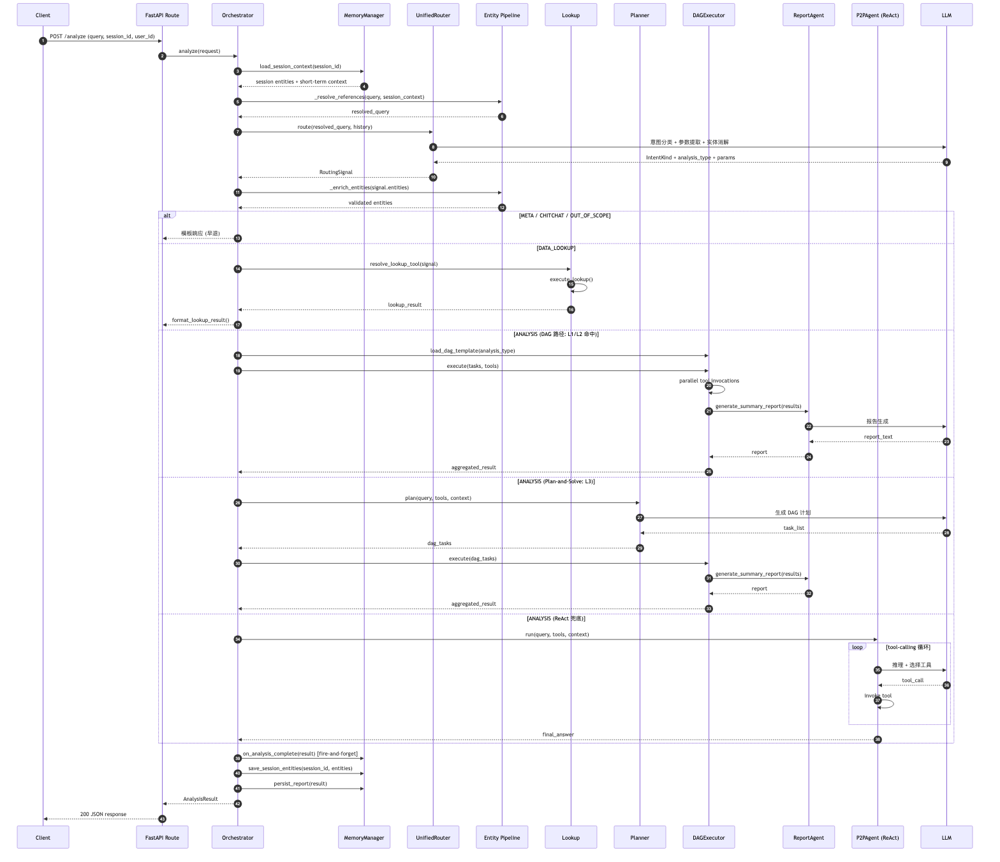

```
```

**覆盖场景**：从请求进入到响应返回的完整生命周期，包含 5 个 phase：会话上下文加载 → 引用消解 → 意图路由（单次 LLM）→ 执行分支（DAG / Plan-and-Solve / ReAct / Lookup / 早退）→ 后处理（Memory 提取 + 实体保存）。

### 9.2 DAGExecutor 并行执行

```mermaid
文件: sequence/seq_dag_execute.mmd
```

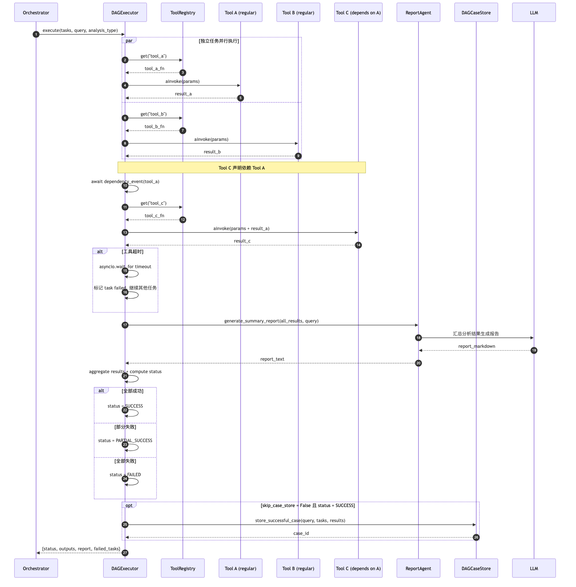

```
```

**覆盖场景**：DAG 任务的依赖感知并行调度。展示独立任务 gather 并行、依赖任务等待 Event、工具分派（regular / report / agent 三类）、超时处理、结果聚合、案例存储。

### 9.3 Memory 读写生命周期

```mermaid
文件: sequence/seq_memory_lifecycle.mmd
```

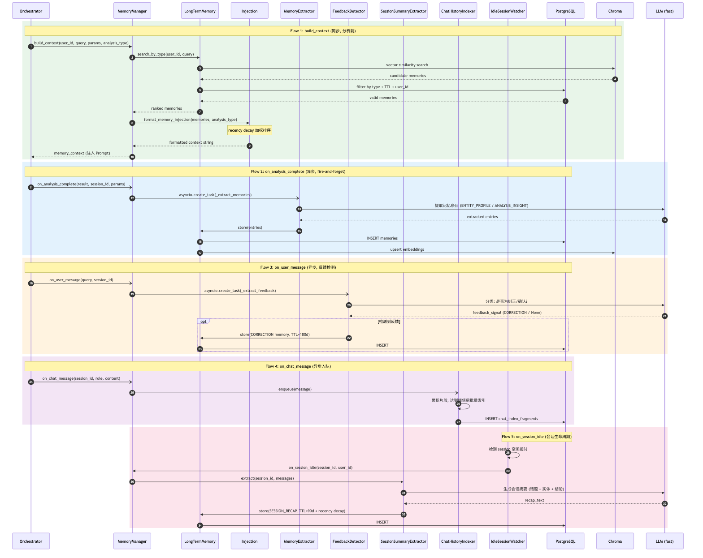

```
```

**覆盖场景**：5 条数据流的完整交互：① 分析前 build_context（同步检索+注入）② 分析后 extract（fire-and-forget 提取）③ 用户反馈检测 ④ 聊天索引入队 ⑤ 会话空闲触发 recap。用不同颜色区分同步/异步流。

### 9.4 ETL Pipeline 同步流程

```mermaid
文件: sequence/seq_etl_sync.mmd
```

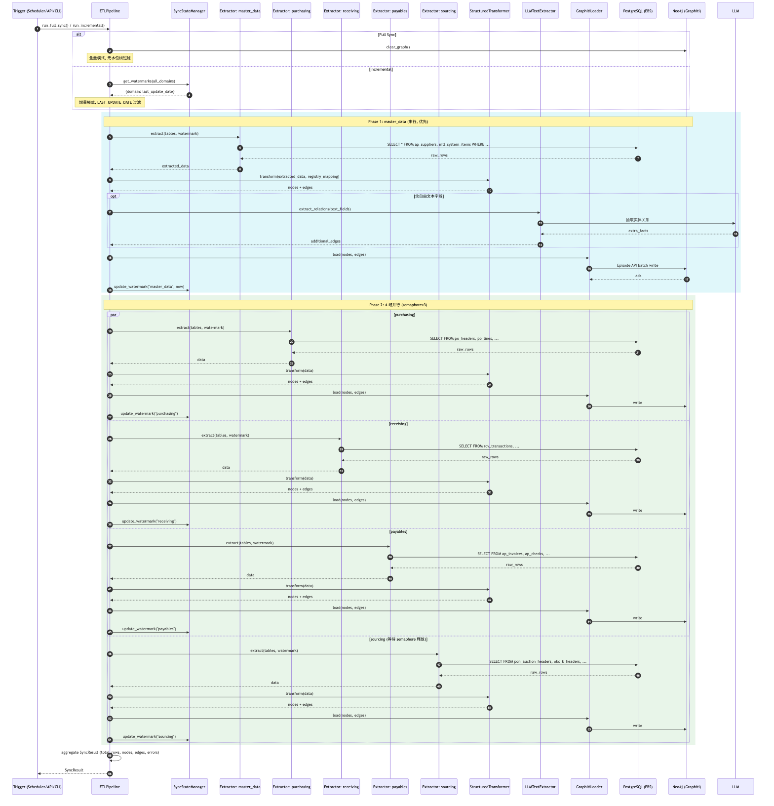

```
```

**覆盖场景**：全量/增量同步的完整三阶段流水线。Phase 1 串行 master_data（保证引用完整性）→ Phase 2 并行 4 域（semaphore=3 限流）→ 每域内 Extract → Transform → Load → 水位线更新。

### 9.5 异步任务 + SSE 推送

```mermaid
文件: sequence/seq_async_sse.mmd
```

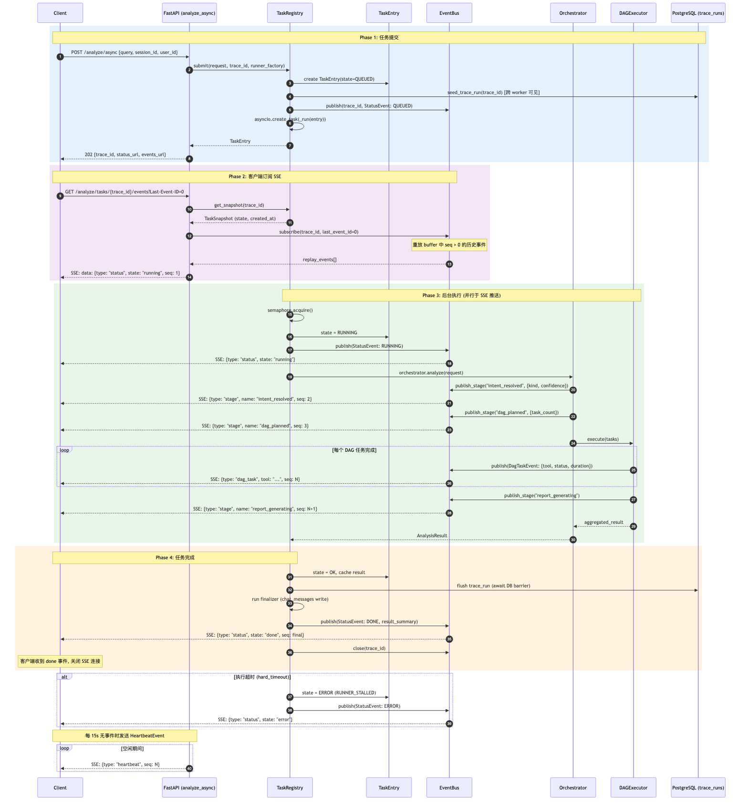

```
```

**覆盖场景**：从 POST 提交到 SSE 实时推送的完整异步链路。4 个 phase：任务提交（202 返回）→ 客户端订阅 SSE（buffer 重放）→ 后台执行（publish_stage 实时推送）→ 完成清理（DB barrier + finalizer + close）。含超时异常路径和心跳机制。
